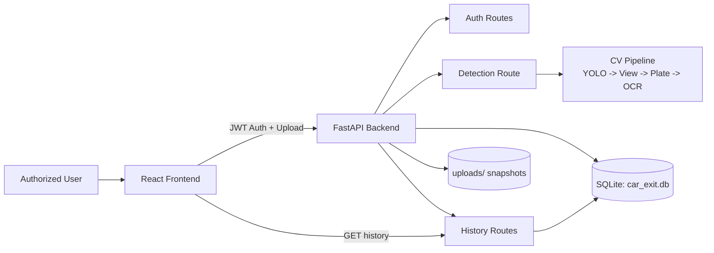
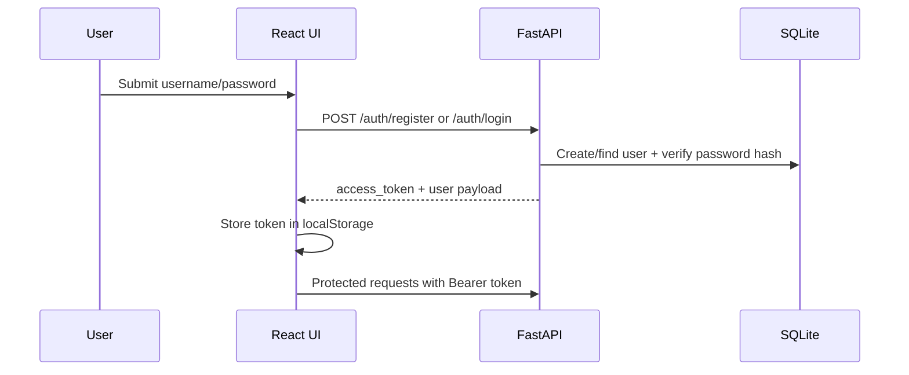
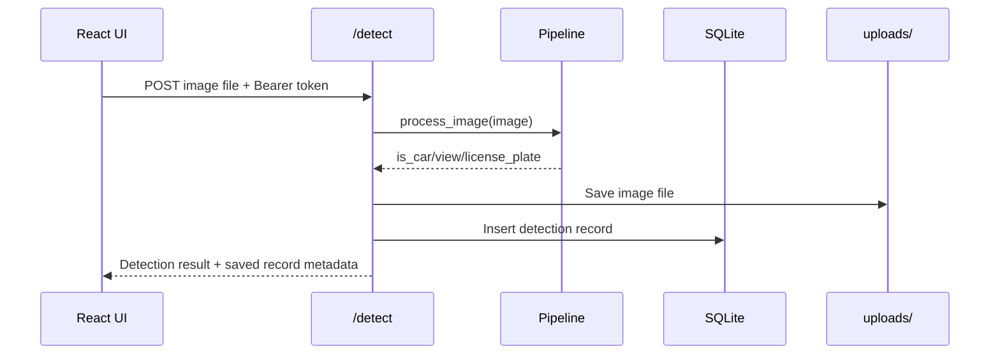
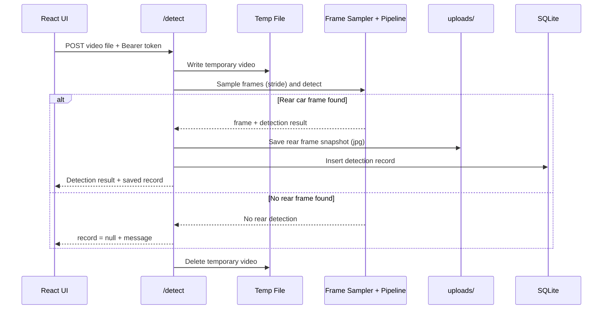
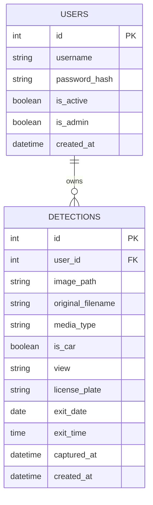

# Car Exit Detection System

Full-stack computer vision system for authorized car-exit monitoring.

It provides:

- User authentication (register/login with JWT)
- Image and video upload support
- Car detection + plate extraction pipeline
- Persistent detection history in SQLite
- Editable and deletable history records
- Local media storage for saved snapshots

## Table of Contents

1. Project Overview
2. How It Works
3. Architecture
4. Data Model
5. API Reference
6. Setup and Run
7. Frontend Behavior
8. Known Limitations
9. Security Notes

## Project Overview

The app is split into two parts:

- Backend: FastAPI application for authentication, detection, and history APIs
- Frontend: React + TypeScript app for login, upload, and history management

Detection behavior by media type:

- Image upload: image is processed and saved
- Video upload: video is processed temporarily; only a rear-car detected frame is saved as an image snapshot

## How It Works

### High-Level System Flow



### Authentication Flow



### Image Detection Flow



### Video Detection Flow



## Architecture

### Backend

- Framework: FastAPI
- Auth: JWT access tokens, bcrypt password hashing
- Database: SQLite via SQLAlchemy ORM
- Computer Vision: Ultralytics YOLO + EasyOCR + OpenCV
- Static media serving: uploads mounted at /uploads

Key backend modules:

- app/main.py: app setup, CORS, startup DB init, router registration, uploads mount
- app/routes/auth.py: register and login endpoints
- app/routes/detect.py: media upload handling, image/video detection flow, persistence
- app/routes/history.py: list/update/delete detection records
- app/services/pipeline.py: detection orchestration
- app/services/model.py: YOLO + OCR model functions
- app/database.py: engine/session/base and startup migration shim

### Frontend

- Framework: React 19 + TypeScript + Vite
- Main view: login/register + detector + history cards
- History actions: inline plate edit, save, cancel, delete

## Data Model

### Entity Relationship Diagram



Notes:

- media_type is currently persisted as image for saved detections
- uploaded videos are transient and not stored permanently

## API Reference

Base URL (local): http://127.0.0.1:8000

### Auth

1. POST /auth/register
   - Body: {"username": "string", "password": "string"}
   - Response: {"access_token": "...", "token_type": "bearer", "user": {...}}

2. POST /auth/login
   - Body: {"username": "string", "password": "string"}
   - Response: same as register

### Detection

3. POST /detect/
   - Auth required: yes
   - Content-Type: multipart/form-data
   - Field: file (image or video)
   - Behavior:
     - Image: processes and stores image
     - Video: samples frames, stores only rear-detection snapshot if found
   - Response example:
     - {
         "is_car": true,
         "view": "rear",
         "license_plate": "ABC123",
         "media_type": "image",
         "record": {
           "id": 10,
           "image_url": "/uploads/user_1/uuid.jpg",
           "media_type": "image",
           "captured_at": "...",
           "exit_date": "...",
           "exit_time": "..."
         }
       }

### History

4. GET /history/
   - Auth required: yes
   - Returns all detections for current user ordered by captured_at desc

5. PATCH /history/{detection_id}
   - Auth required: yes
   - Body: {"license_plate": "NEW123"} (empty string clears plate)
   - Returns updated detection record

6. DELETE /history/{detection_id}
   - Auth required: yes
   - Deletes the detection row and its saved snapshot file
   - Returns: 204 No Content

## Setup and Run

### Prerequisites

- Python 3.11+ recommended
- Node.js 18+ recommended

### 1) Clone

```bash
git clone https://github.com/YOUR_USERNAME/car-exit-system.git
cd car-exit-system
```

### 2) Backend setup

```bash
python -m venv .venv
source .venv/bin/activate
pip install -r requirements.txt
python run.py
```

Backend runs at http://127.0.0.1:8000

On startup:

- car_exit.db is created if missing
- tables are created if missing
- uploads directory is created if missing

### 3) Frontend setup

```bash
cd car-ui
npm install
npm run dev
```

Frontend runs at http://localhost:5173

### 4) Frontend environment

Create car-ui/.env:

```bash
VITE_API_URL=http://127.0.0.1:8000
```

### Optional backend env vars

You can define these for stronger security:

- SECRET_KEY: JWT signing key (change from default in production)
- ACCESS_TOKEN_EXPIRE_MINUTES: token lifetime (default 1440)

## Frontend Behavior

- Login/register panel for authorized access
- Upload accepts image and video
- File input auto-resets after Run detection
- History cards support:
  - Edit license plate
  - Save or cancel changes
  - Delete record
- History is scoped to the authenticated user

## Known Limitations

- classify_view currently returns rear as a placeholder
- detect_plate currently returns the car crop placeholder
- OCR and detection quality depend on model/input quality
- CORS is currently open for development use

## Security Notes

- Passwords are hashed (bcrypt via passlib)
- Endpoints under /detect and /history require Bearer JWT
- Default SECRET_KEY is for development only; replace it before deployment

## Author

Ryan Aparicio
