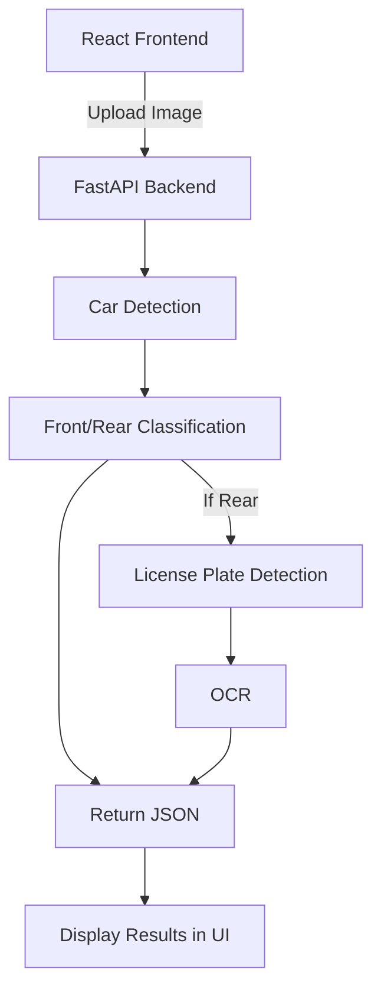

# Car Exit Detection System

A full-stack computer vision web application that:
- Detects cars in images
- Classifies whether the car is front or rear view
- Extracts license plates (for rear view)

---

## System Overview

This project uses:
- **FastAPI** for backend ML inference
- **React (TypeScript + Vite)** for frontend
- Computer Vision pipeline (YOLO + classification + OCR)

---

## Architecture

Frontend (React)
→ Upload Image  
→ FastAPI Backend  
→ ML Pipeline:
  1. Car Detection
  2. Front/Rear Classification
  3. License Plate Detection (if rear)
  4. OCR

---

## Tech Stack

### Backend
- FastAPI
- OpenCV
- PyTorch

### Frontend
- React (TypeScript)
- Vite

---

## Setup Instructions

### 1. Clone repo

```bash
git clone https://github.com/YOUR_USERNAME/car-exit-detection-system.git
cd car-exit-detection-system
```

#### Backend Setup
```bash
pip install -r requirements.txt
python run.py
```

Backend runs at:
http://127.0.0.1:8000

####Frontend Setup
```bash
cd car-ui
npm install
npm run dev
```
Frontend runs at:
http://localhost:5173

#### Environment Variables

Create a .env file inside car-ui/:

VITE_API_URL=http://127.0.0.1:8000

---

## Usage

Open frontend

Upload image

Click "Run Detection"

View results


---

## Current Status
✅ Integrate YOLOv8 for car detection

✅ Add front/rear classifier model

✅ License plate detection + OCR

✅ Image upload working

✅ API pipeline working

---

## Future Improvements
🚧 Real-time camera support

🚧 Deploy to cloud

---

# 4. System Diagram

Here’s a **simple diagram you can paste into README**:


## System Diagram


